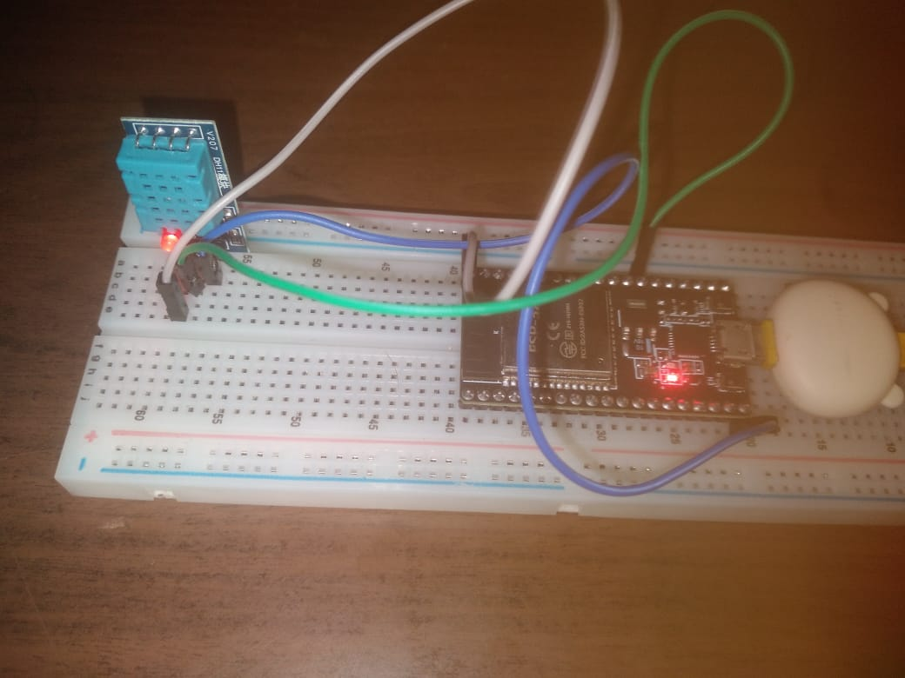
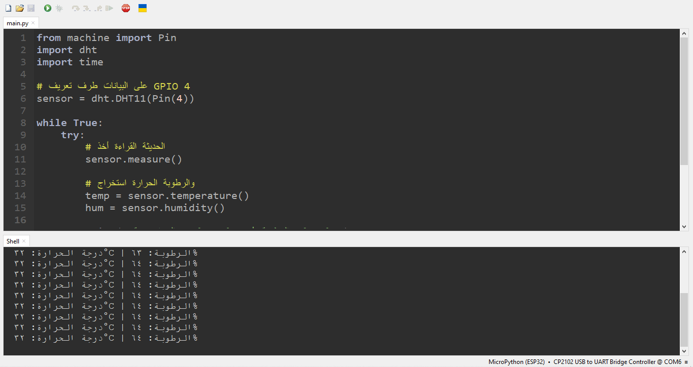

# 🌡️ ESP32 & DHT11 Temperature / Humidity Sensor

مشروع بسيط وبسيط جداً لقراءة درجات الحرارة والرطوبة باستخدام لوحة ESP32 وحساس DHT11 باستخدام لغة MicroPython.

---

## 🛠️ المكونات (Hardware)

* ESP32 Board
* DHT11 Sensor
* Jumper Wires

---

## 🔌 التوصيل (Wiring)

| DHT11 Pin | ESP32 Pin |
| :--- | :--- |
| **VCC** | **3.3V** |
| **Data** | **GPIO 4** |
| **GND** | **GND** |

---

## 📐 مخطط التوصيل (Wiring Diagram)

---

## 📸 التوصيل الواقعي (Real Hardware Setup)

---

## 🎬 التجربة الحية (Live Demo)

---

## 🚀 التشغيل (Usage)

1. ارفع ملف `main.py` على بوردة ESP32 باستخدام برنامج Thonny IDE.
2. شغل السكريبت وشوف القراءات بتظهر بشكل مباشر على الـ Shell.
